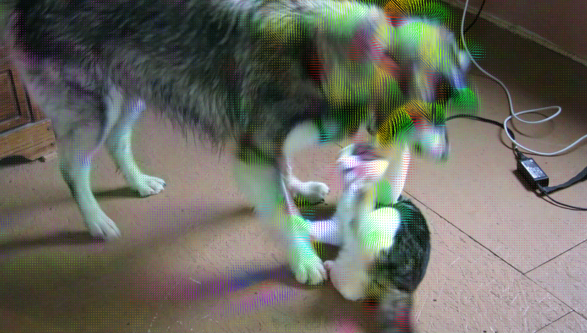

# Homework 4 #

Welcome friends,

It's time for optical flow!

## 4.1 Integral images ##

Optical flow has to run on video so it needs to be fast! We'll be calculating structure matrices again so we need to do aggregated sums over regions of the image. However, instead of smoothing with a Gaussian filter, we'll use [integral images](https://en.wikipedia.org/wiki/Summed-area_table) to simulate smoothing with a box filter.

Fill in `make_integral_image` as described in the wikipedia article. You may not want to use the `get_pixel` methods unless you do bounds checking so you don't run into trouble.

## 4.2 Smoothing using integral images ##

We can use our integral image to quickly calculate the sum of regions of an image. Fill in `box_filter_image` so that every pixel in the output is the average of pixels in a given window size.

## 4.3 Lucas-Kanade optical flow ##

We'll be implementing [Lucas-Kanade](https://en.wikipedia.org/wiki/Lucas%E2%80%93Kanade_method) optical flow. We'll use a structure matrix but this time with temporal information as well. The equation we'll use is:

### 4.3.1 Time-structure matrix ###

We'll need spatial and temporal gradient information for the flow equations. Calculate a time-structure matrix. Spatial gradients can be calculated as normal. The time gradient can be calculated as the difference between the previous image and the next image in a sequence. Fill in `time_structure_matrix`.

### 4.3.2 Calculating velocity from the structure matrix ###

Fill in `velocity_image` to use the equation to calculate the velocity of each pixel in the x and y direction. For each pixel, fill in the `matrix M`, invert it, and use it to calculate the velocity. Note: the structure matrix may not be invertible. Make sure you check the return value and set the velocity to zero if the matrix is not invertible (this usually happens when there is no gradient i.e. all pixels in a region are the same color).

Try calculating the optical flow between two dog images:

    a = load_image("data/dog_a.jpg")
    b = load_image("data/dog_b.jpg")
    flow = optical_flow_images(b, a, 15, 8)
    draw_flow(a, flow, 8)
    save_image(a, "lines")

It may look something like:

## 4.4 Optical flow demo using OpenCV ## 

Using OpenCV we can get images from the webcam and display the results in real-time. Try installing OpenCV and enabling OpenCV compilation in the Makefile (set `OPENCV=1`). Then run:

    optical_flow_webcam(15,4,8)

## Turn it in ##

Besides submitting your program, you need to make video-demo which shows how you run your program, and how the result appears.
put them all in under your name and NIM under assignment 4.
.

